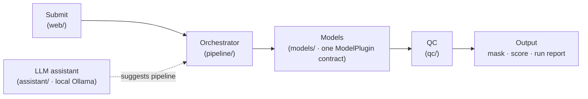

<div align="center">


# Fovea

**An open skeleton for building production medical-imaging AI pipelines.**

[](LICENSE)
[](pyproject.toml)
[](#)
[](https://bartekllc.org)

*Turn models into a pipeline that ingests a case, runs the right models, quality-checks the output, and serves a result — reliably and reproducibly.*

</div>

---

Most medical-imaging AI dies between "it works in my notebook" and "the team uses it every day." **Fovea is a small, opinionated starting point for the second part** — the plumbing, not the model.

It's **not** a framework you're locked into, and **not** anyone's proprietary system. It's a scaffold you clone and make your own.

## ✨ Why Fovea

- **One model contract** — every model (yours, open-source, or a hosted API) implements the same tiny `ModelPlugin` interface. Add a model = write one class.
- **A stage orchestrator** — `ingest → preprocess → models → QC → output`, each stage isolated, timed, logged. Plain Python by default; swap in Airflow/Prefect/Dagster for production without touching your models.
- **Quality control** — catch empty masks, out-of-range scores, and drift *before* a result is trusted.
- **Optional local-LLM assistant** — a local [Ollama](https://ollama.com) model *suggests* which models to run (data never leaves your hardware). A suggestion, not autopilot. Falls back to a rule if Ollama isn't running.
- **Runs out of the box** — two placeholder models + a dummy image, zero external deps.

## 🚀 Quickstart

```bash
git clone https://github.com/<you>/fovea.git
cd fovea
pip install -e .

fovea run --demo          # run the demo pipeline
fovea models              # list available models
fovea suggest "segment the lesion and score it"
```

```text
$ fovea run --demo
{
  "status": "ok",
  "plan": ["threshold-segmenter", "region-scorer"],
  "score": { "score": 14.06 },
  "qc": { "nonempty_mask": { "pass": true, "coverage": 0.14 } }
}
```

## 🧭 Architecture



Each model is wrappable in its own container; the orchestrator, QC, and assistant never care what's inside.

## 🔧 Make it yours

```python
from fovea.models.base import ModelPlugin, ModelResult
from fovea.models.registry import register

@register
class MySegmenter(ModelPlugin):
    name = "my-segmenter"
    modality = "oct-bscan"
    description = "Retinal layer segmentation."
    def run(self, case):
        mask = my_model(case["image"])
        return ModelResult(self.name, output=mask)
```

Then `fovea run --models my-segmenter,region-scorer` — or let the assistant choose. Add QC in `fovea/qc/`, containerize with `containers/Dockerfile.model`, and swap the orchestrator for an Airflow DAG when you productionize. See [docs/architecture.md](docs/architecture.md).

## 📦 What it is / isn't

| It IS | It ISN'T |
|---|---|
| A clean starting pattern for imaging-AI pipelines | A turnkey product or heavy framework |
| Model-agnostic (bring any model) | Tied to a vendor or dataset |
| A teaching / reference scaffold | Anyone's proprietary pipeline |
| Yours to fork and ship | Medical advice or a cleared device |

## 📂 Layout

```
fovea/
├─ models/       ModelPlugin contract + registry + example models
├─ pipeline/     orchestrator (stage runner)
├─ qc/           quality-control checks
├─ assistant/    optional local-LLM pipeline suggester (Ollama)
├─ web/          submission API stub (FastAPI)
└─ cli.py        the `fovea` command
```

## 🤝 Contributing

Issues and PRs welcome — see [CONTRIBUTING.md](CONTRIBUTING.md). Built and maintained by [**BARTEK LLC**](https://bartekllc.org).

## 📄 License

[Apache-2.0](LICENSE) — free for commercial and private use.
