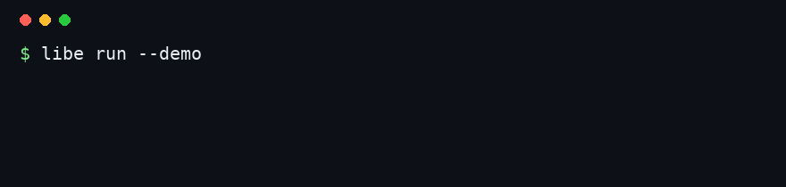
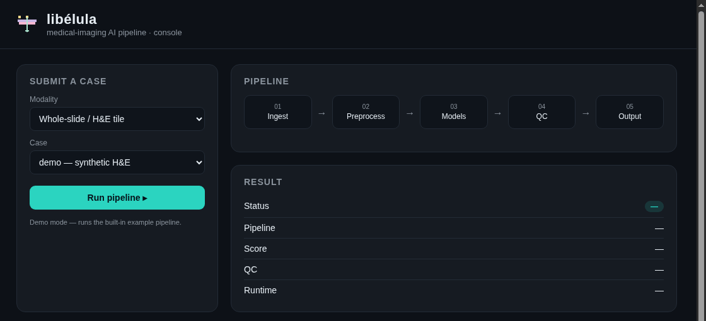
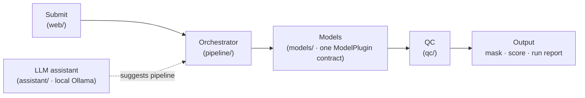

<div align="center">


# libélula

**Small pipeline, sharp vision.** — an open skeleton for building production medical-imaging AI pipelines.

[](https://github.com/maberyick/libelula/actions/workflows/ci.yml)
[](LICENSE)
[](pyproject.toml)
[](#)
[](https://bartekllc.org)



</div>

---

Most medical-imaging AI dies between "it works in my notebook" and "the team uses it every day." **libélula is a small, opinionated starting point for the second part** — the plumbing, not the model.

It's **not** a framework you're locked into, and **not** anyone's proprietary system. It's a scaffold you clone and make your own.

It's the same pattern behind real **pathomics** (digital-pathology feature/segmentation pipelines) and **radiomics** (radiology) platforms — where a team needs to host many analysis tools behind one reproducible, orchestrated workflow.

## 🜛 Why *libélula*?

*Libélula* is Spanish for **dragonfly** — and a dragonfly is exactly what a good pipeline should be:

- **All eyes.** Its compound eyes see almost 360°. Your pipeline should *see* every case — with quality control watching the whole way through.
- **Precise.** Dragonflies catch prey ~95% of the time, among the most accurate hunters alive. A pipeline earns trust by being right, reproducibly.
- **Agile.** Light, fast, four independent wings. Swap a model, add a stage, move it to another orchestrator — nothing else has to change.

## 🚀 Quickstart

```bash
git clone https://github.com/<you>/libelula.git
cd libelula
pip install -e .
```

```console
$ libe
     ▟▓▙  ▟▓▙          (a colored pixel dragonfly prints here — try it)
  ▂▄▆█████▆▄▂
  ✦ libélula v0.1.0  — medical-imaging AI pipeline · agile, precise
  🪰 all eyes · precise · agile — a skeleton for medical-imaging AI pipelines

$ libe run --demo
  ✦ libélula v0.1.0  — medical-imaging AI pipeline · agile, precise
  ✓ pipeline: threshold-segmenter → region-scorer
  ◆ status ok · score 14.06 · QC pass · 0.1ms

$ libe models
  ◆ threshold-segmenter  [generic-image]  Segments bright regions…
  ◆ region-scorer        [generic-image]  Turns a mask into a score…

$ libe suggest "segment the lesion and score it"
  ◆ threshold-segmenter → region-scorer
```

Runs out of the box — two placeholder models + a dummy image, zero external deps.

**More examples:**
```bash
pip install -e ".[examples]"
python examples/run_realistic.py     # real Otsu + connected-component segmentation
cat examples/airflow_dag.py          # same pipeline as an Airflow DAG (productionize)
pytest -q                            # the test suite (pip install -e ".[dev]")
```

## 🖥️ Web console (optional)

```bash
pip install -e ".[web]"
libe serve            # → http://127.0.0.1:8000
```

<div align="center"></div>

A minimal, self-contained console for the **submit → monitor → review** loop — a starting point you extend, not a heavyweight app.

## 🧭 Architecture



- **One model contract** — every model (yours, open-source, or a hosted API) implements the same tiny `ModelPlugin`. Add a model = write one class.
- **A stage orchestrator** — `ingest → preprocess → models → QC → output`, isolated, timed, logged. Plain Python by default; swap in Airflow/Prefect/Dagster for production without touching your models.
- **Quality control** — catch empty masks, out-of-range scores, and drift *before* a result is trusted.
- **Optional local-LLM assistant** — a local [Ollama](https://ollama.com) model *suggests* which models to run (data never leaves your hardware). A suggestion, not autopilot; falls back to a rule if Ollama isn't running.

## 🔧 Make it yours

```python
from libelula.models.base import ModelPlugin, ModelResult
from libelula.models.registry import register

@register
class NucleiSegmenter(ModelPlugin):
    name = "nuclei-segmenter"
    modality = "wsi-tile"
    description = "Nucleus segmentation on H&E tiles."
    def run(self, case):
        mask = my_model(case["image"])
        return ModelResult(self.name, output=mask)
```

Then `libe run --models nuclei-segmenter,region-scorer` — or let the assistant choose. Add QC in `libelula/qc/`, containerize with `containers/Dockerfile.model`, and swap the orchestrator for an Airflow DAG when you productionize. See [docs/architecture.md](docs/architecture.md).

## 📦 What it is / isn't

| It IS | It ISN'T |
|---|---|
| A clean starting pattern for imaging-AI pipelines | A turnkey product or heavy framework |
| Model-agnostic (bring any model) | Tied to a vendor or dataset |
| A teaching / reference scaffold | Anyone's proprietary pipeline |
| Yours to fork and ship | Medical advice or a cleared device |

## 📂 Layout

```
libelula/
├─ models/       ModelPlugin contract + registry + example models
├─ pipeline/     orchestrator (stage runner)
├─ qc/           quality-control checks
├─ assistant/    optional local-LLM pipeline suggester (Ollama)
├─ web/          submission API stub (FastAPI)
└─ cli.py        the `libe` command
```

## 🤝 Contributing · 📄 License

Issues and PRs welcome — see [CONTRIBUTING.md](CONTRIBUTING.md). [Apache-2.0](LICENSE), free for commercial and private use. Built and maintained by [**BARTEK LLC**](https://bartekllc.org).
